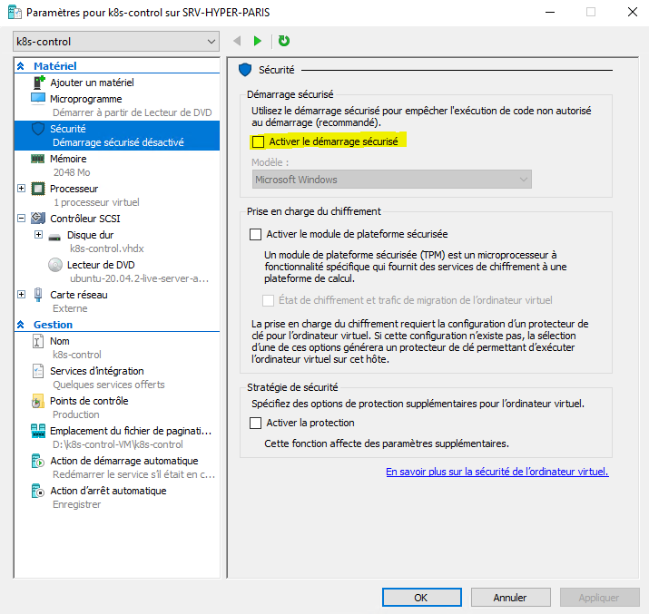
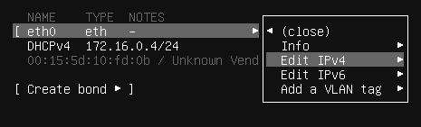
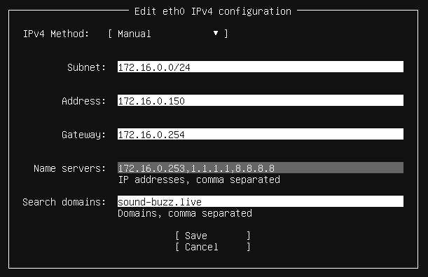
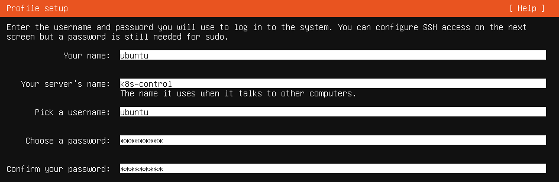

# Deploiement d'un cluster Kubernetes
## Création des VM
On commence par créer des machines virtuelles pour composer notre futur cluster k8s (k8s : Kubernetes).
On utilise un système d'exploitation Linux : ubuntu server 20.04.2 LTS.

> Vous pouvez télécharger l'image via ce lien : [Ubuntu Server](https://mirrors.ircam.fr/pub/ubuntu/releases/20.04.2/ubuntu-20.04.2-live-server-amd64.iso).

Dans notre environement, les machines virtuelles sont hébergées avec hyper-V. Nous attribuons 2048Mo de RAM, 20Go d'espace disque et 2 CPU virtuels pour chaque VM. On ajoutera à chaque VM une carte réseau utilisant le même réseau que le reste de l'infrastructure.

> Nous utilisons des systèmes invités Linux avec Hyper-V, pour réussir à installer l'OS correctement, il faut bien désactiver le "démarrage sécurisé" dans les options de chaque VM avant leur premier démarrage : 

Nous créons 3 VM :
- k8s-control
- k8s-node1
- k8s-node2

Il est possible d'ajouter autant de machines que l'on souhaite au cluster, chaque node suivra la même procédure lors de sa configuration. On créera alors sur le même modèle que nos VM "k8s-node1" et "k8s-node2", autant de VM "k8s-nodeX" que l'on souhaite. Nous nous limitons ici à 3 machines par soucis de simplicité.

## Installation d'ubuntu server
Dans cette rubrique, je ne prendrais pour exemple que la VM "k8s-control", il faudra cependant effectuer les opérations sur chaque VM, en adaptant certains paramètres le cas échéant (noms d'hôtes, addresses ip, ...).

Au premier lancement, il nous est proposé plusieurs options, nous choisissons "Install Ubuntu Server".

> Nous ferons l'installation en Anglais, mais vous pouvez la faire dans une autre langue, cela n'aura pas d'impact sur la suite, modulo la traduction des menus. Si aucune instruction n'est fournie ici concernant un menu, laissez les options par défaut.

Vous pouvez choisir la configuration de votre clavier dans l'écran suivant le choix de la langue.

Nous commençons par modifier les paramètres réseau de la carte à partir du menu suivant.



> Attention à bien donner une addresse ip différente pour chaque VM, on prendra les ip à partir de .150 ici, mais libre à vous de choisir votre propre plage.

Le reste des options sera laissé par défaut, à l'exception de 2 menus :
- On active le serveur open-SSH (facultatif, permet par la suite de se connecter en ssh au serveur plutôt que de passer par l'interface Hyper-V).
- Le menu "Profile setup", dont la configuration sera comme suit (attention à bien adapter le nom de la machine) : 
  Vous êtes libre d'utiliser un nom d'utilisateur et un mot de passe de votre choix. Ici "ubuntu" n'est qu'un exemple. Ce compte correspond au compte administrateur par défaut de la machine.

Une fois l'installation completée et les mises à jour de sécurité installées, il ne vous reste qu'à redémarrer chaque machine (pensez à éjecter le média d'installation).

## Configuration initiale
Si vous avez choisi d'activer le serveur open-SSH, vous pouvez ajouter votre clé publique au fichier ```~/.ssh/authorized_keys``` pour vous connecter en ssh sans entrer votre mot de passe à chaque fois.

> Plus d'informations sur les clés ssh : [SSH keys](https://www.ssh.com/academy/ssh/key)

Avant d'installer k8s, il nous faut un environement de containerisation. On va installer docker puis ajouter l'utilisateur au groupe docker (pour pouvoir interragir avec docker sans entrer de mdp à chaque fois ; ici l'utilisateur "ubuntu") :
```shell
curl -sSL get.docker.com | sh
sudo usermod -aG docker ubuntu
```

On configure les options du docker daemon dans un fichier daemon.json (on le créé, il n'est pas présent par défaut) ```/etc/docker/daemon.json``` :

```json
{
  "exec-opts": ["native.cgroupdriver=systemd"],
  "log-driver": "json-file",
  "log-opts": {
    "max-size": "100m"
  },
  "storage-driver": "overlay2"
}
```
On autorise le "port forwarding" (nécessaire pour générer l'environement réseau des containers) : on modifie pour cela le fichier ```/etc/sysctl.conf``` en modifiant la ligne ```#net.ipv4.ip_forward=1``` en : ```net.ipv4.ip_forward=1``` (on dé-commente l'option en retirant le #).

On peut maintenant redémarrer le serveur et tester si docker est correctement installé avec la commande : ```docker run hello-world```.
Vous devriez avoir ce message à l'écran si tout est correctement installé :
```shell
Hello from Docker!
This message shows that your installation appears to be working correctly.

To generate this message, Docker took the following steps:
 1. The Docker client contacted the Docker daemon.
 2. The Docker daemon pulled the "hello-world" image from the Docker Hub.
    (amd64)
 3. The Docker daemon created a new container from that image which runs the
    executable that produces the output you are currently reading.
 4. The Docker daemon streamed that output to the Docker client, which sent it
    to your terminal.

To try something more ambitious, you can run an Ubuntu container with:
 $ docker run -it ubuntu bash

Share images, automate workflows, and more with a free Docker ID:
 https://hub.docker.com/

For more examples and ideas, visit:
 https://docs.docker.com/get-started/
```

Vous pouvez aussi vérifier que le service docker est bien actif avec ```systemctl status docker```.

## Installation de kubernetes
On peut maintenant installer kubernetes sur chaque VM. On commence par ajouter le **repository** kubernetes en créant le fichier ```/etc/apt/sources.list.d/kubernetes.list``` avec le contenu suivant :
```
deb http://apt.kubernetes.io/ kubernetes-xenial main
```
On récupère la clé GPG pour valider le **repository** :
```shell
curl -s https://packages.cloud.google.com/apt/doc/apt-key.gpg | sudo apt-key add -
```

On peut désormais mettre à jour notre index puis installer k8s :
```shell
sudo apt update
sudo apt install kubeadm kubectl kubelet
```

## Création du cluster
### Controler
Avant de commencer, on désactive le *swap* sur la VM *k8s-controler* : ```sudo swapoff -a```

Uniquement sur la VM *k8s-controler*, on execute la commande suivante :
```shell
sudo kubeadm init --pod-network-cidr=10.244.0.0/16
```

La commande devrait sortir dans le terminal une ligne de ce type :
```kubeadm join 172.16.0.150:6443 --token 61z7u0.owjzoqjtzvm3djov --discovery-token-ca-cert-hash sha256:0200952490e9f8a8834c62d7545400a652f82674f0bad35663d1acd01ac623b7```.

Gardez cette commande de côté, elle servira plus tard.
> Attention : Ce sont des données assez sensibles d'un point de vue sécurité, faites attention à ne pas partager cette commande, et à ne pas la conserver une fois qu'elle n'est plus utile.

Lancez maintenant les commandes suivantes :
```shell
mkdir -p $HOME/.kube
sudo cp /etc/kubernetes/admin.conf $HOME/.kube/config
sudo chown $(id -u):$(id -g) $HOME/.kube/config
```
Elles se trouvent aussi dans la sortie de la commande précédente, si elles sont différentes chez vous, adaptez cette étape.

On doit maintenant installer un driver pour gérer le réseau au sein du cluster. On va utiliser flannel :
```shell
kubectl apply -f https://raw.githubusercontent.com/coreos/flannel/master/Documentation/kube-flannel.yml
```

> Remarque : On utilise kubectl, cette commande nous permet d'effectuer des opérations sur le cluster depuis une machine distante, ici notre VM control ! Il est configuré grâce aux étapes précédentes. On notera aussi qu'il n'est pas nécessaire d'utiliser **sudo**.

On vérifie que tout fonctionne correctement avec ```kubectl get pods --all-namespaces```. On devrait voir plusieurs pods déployés, notamment un pod **flannel**.

### Nodes

> Pensez à désactiver *swap* pour les nodes (de la même manière que pour le controler) avant de join le cluster.

On peut maintenant ajouter les nodes au cluster. On va, pour chaque node, éxecuter la commande conservée précédemment (avec l'ajout de sudo cette fois ci ; attention la votre est différente de celle présentée en exemple ici).

```shell
sudo kubeadm join 172.16.0.150:6443 --token 61z7u0.owjzoqjtzvm3djov --discovery-token-ca-cert-hash sha256:0200952490e9f8a8834c62d7545400a652f82674f0bad35663d1acd01ac623b7
```

Notre cluster k8s est maintenant opérationnel, on peut désormais effectuer des opérations dessus via kubectl depuis *k8s-control*.

On peut avoir un aperçu du cluster avec la commande :
```shell
kubectl get nodes -o wide
```
